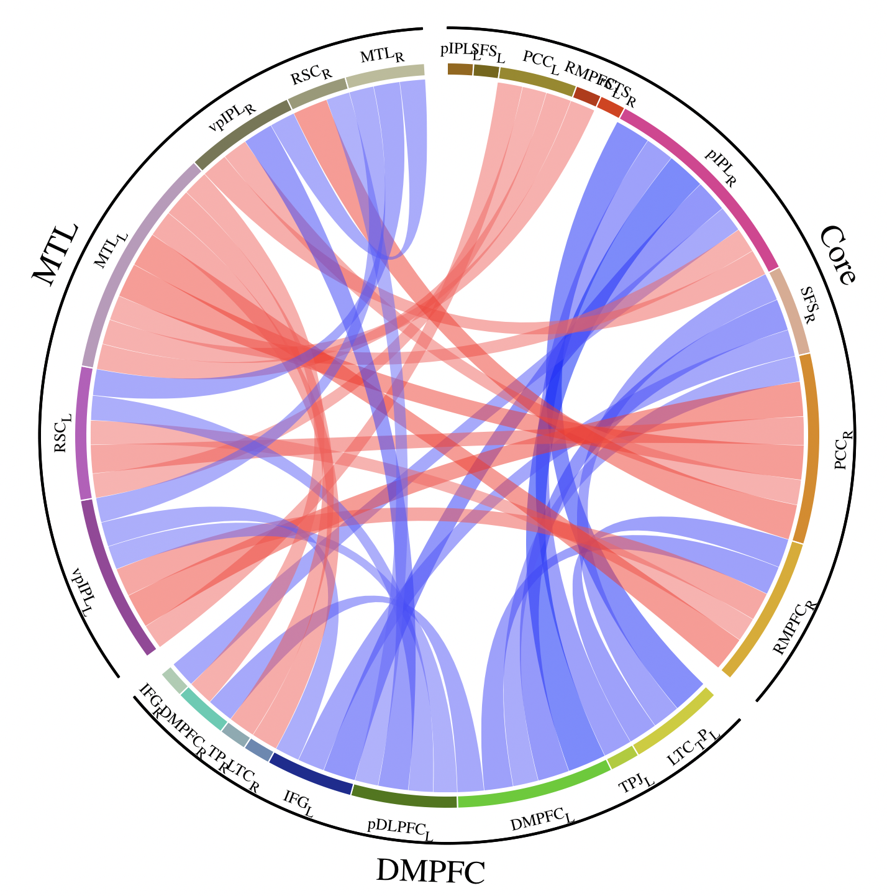

# CorticalNetworkCircos
 Circos plot describes cortical networks and regions

PS: recommand to use SVG image.

0. **CircosPlot.conf**

Configuration file conducts Circos to plot.

1. **CircosDataOrganize.m**

MATLAB function for organize data to satisfy Circos source txt file format, and define details of cortical map.

2. **TEST_function.m**

Script demostrates how to set parameter of function.

3. **CircosInput1_band.txt**

File stores data of external network and internal region band.

4. **CircosInput2_label.txt**

File stores data of internal band label.

5. **CircosInpput3_link.txt**

File stores data of links between correlated regions

6. **MANUAL_DataFormat.txt**

Manual demostrate data format of source mat file.

7. **RawDataCircos.mat**

Demo source data, can immitate format.

---

NOT USED FILES:

cort_color.conf